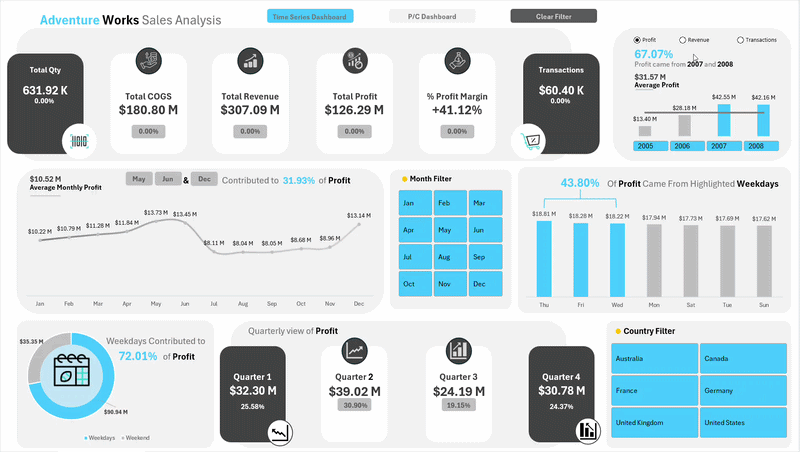

# Adventure Works Sales & Business Performance Analysis (Excel)

An interactive, multi-view business intelligence dashboard built entirely within Microsoft Excel to analyze over 60,000 rows of global historical sales records. This project demonstrates advanced data cleaning, relational data modeling, and interactive user interface (UI) design using native Excel tools.

---

## 📊 Dynamic UI & Interaction Demo

Since raw Excel sheets cannot be fully experienced natively on GitHub, the animated overview below demonstrates the active interface features, including dynamic dashboard views, synchronized slicers, and custom clear filter functions:

---

## 🛠️ Core Technical Architecture

### 1. Data Transformation (Power Query)
* Cleaned and standardized multi-table structures containing nested attributes, missing values, and localized currency variations.
* Transformed date dimensions to handle customized financial calculations (e.g., separating weekend vs. weekday sales trends).

### 2. Star Schema Optimization (Power Pivot)
* Bypassed traditional resource-heavy lookup formulas like `VLOOKUP` or `XLOOKUP` by constructing a fully optimized **Star Schema Relational Model**.
* Linked **6 separate relational tables** (Sales Fact, Product Dim, Customer Dim, Geography Dim, Territory Dim, and Calendar Dim) using active 1-to-many relationships to maximize data engine performance.

### 3. Advanced Analytical Metrics
* Developed robust key business metrics using advanced Pivot calculations to track essential corporate health indicators:
  * **Profit Margin Analysis:** Dynamic tracking of total revenue versus total Cost of Goods Sold (COGS) yielding a +41.12% global margin.
  * **Temporal Trends:** Quarterly performance metrics mapped alongside operational weekday vs. weekend revenue splits (identifying that weekends contribute to 72.01% of total profit).
  * **Product Portfolio Segmentation:** Categorized high-value customer segments and color-coded item sales distribution profiles.

### 4. Executive Interface Design
* Implemented custom tab navigation selectors (**Time Series Dashboard** vs. **P/C Dashboard**) mimicking native software application UI.
* Integrated synchronized cross-report slicers (Country, Month, Year, and Price Ranges) alongside a dedicated **Clear Filter** macro trigger to allow business stakeholders to seamlessly segment metrics with a single click.

---

## 📂 Project Directory

* `Adventure Works Sales Analysis.zip` — Compressed archive containing the core workbook housing the Power Query transformations, relational data models, and interactive macro dashboards.
* `Dashboard_Demo.gif` — Visual interface demonstration asset.
